# API Architecture Diagrams

Mermaid diagrams for every feature area of the Norviq backend (`StockPlanBackend`, Swift/Vapor). Route registration lives in `Sources/StockPlanBackend/routes.swift`; the machine-readable contract is `Sources/StockPlanBackend/openapi.yaml` (served at `/openapi.yaml`, Swagger UI at `/docs`).

Conventions used below:

- All application routes are mounted under the global `/v1` prefix unless noted (webhooks, `/share`, `/.well-known`, health, and `/metrics` are mounted at the root).
- **Session auth** = `SessionToken` bearer (first-party iOS/web clients). **Scoped PAT/OAuth** = `ScopedBearerAuthenticator` scopes (e.g. `market:read`) used by MCP and API integrations.
- Controllers query Postgres via Fluent; Redis backs hot caches and rate limits.

## System overview

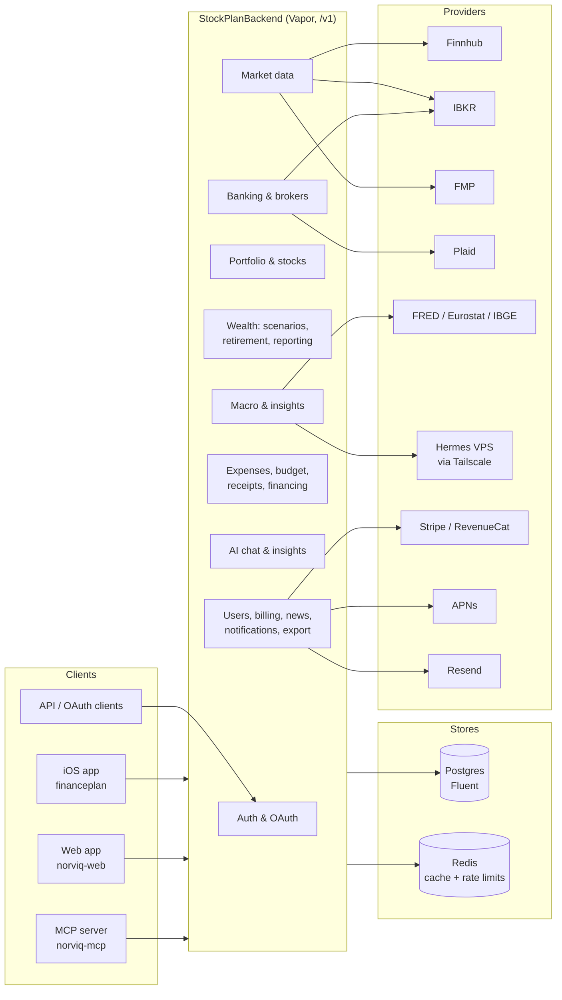

## Auth, OAuth 2.1 and personal access tokens

Controllers: `Auth/AuthController.swift`, `Auth/PersonalAccessTokenController.swift`, `OAuth/OAuthServerController.swift`, `OAuth/TokenIntrospectionController.swift`, `OAuth/WellKnownController.swift`.

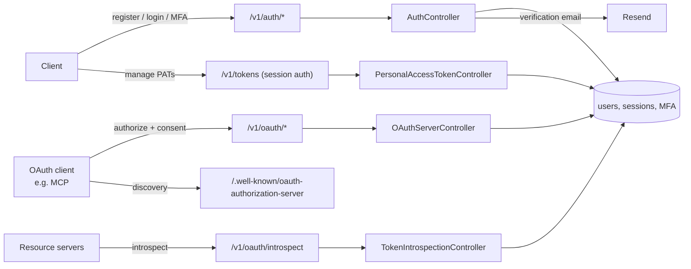

## Billing

Controllers: `Billing/BillingController.swift`, `Billing/RevenueCatWebhookController.swift`.

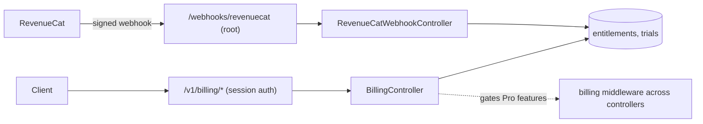

## Stocks, watchlist, research and targets

Controller: `Stocks/StockController.swift` (+ `StockController+Watchlist.swift`), service `Stocks/StockService.swift`.

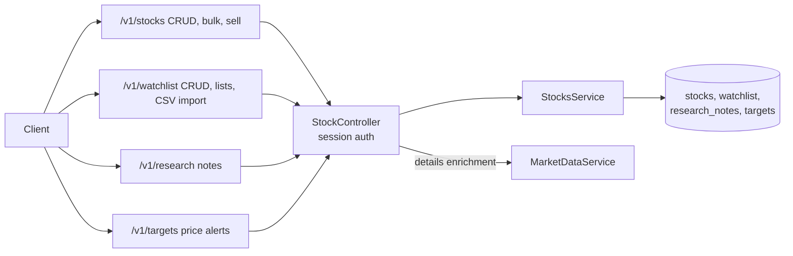

## Market data

Controller: `Market/MarketDataController.swift` (scoped `market:read` for PAT access), service `Market/MarketDataService.swift`, providers under `Market/`.

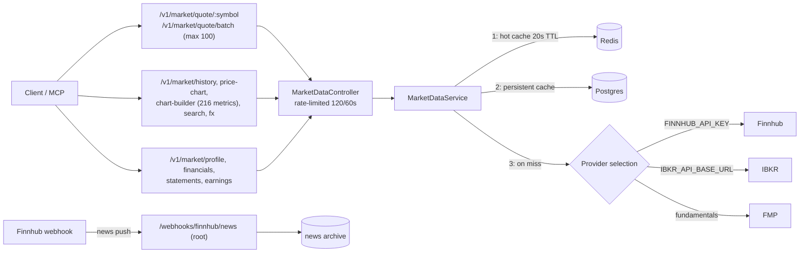

## Portfolio and P&L

Controller: `Portfolio/PortfolioController.swift`. `/v1/pnl` joins holdings with cached quotes server-side (shared DTO `PnlBySymbol`).

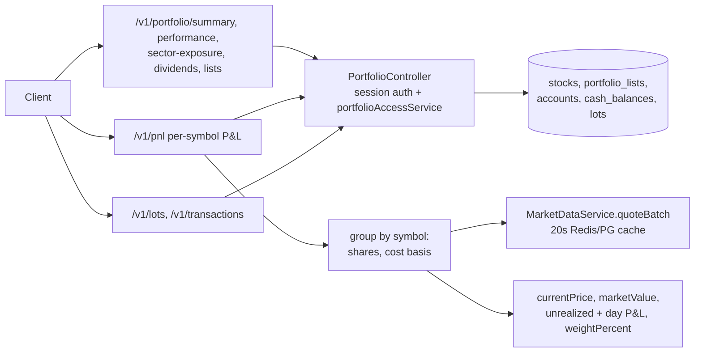

## Portfolio management, retirement, reporting and wealth automation

Controllers: `Portfolio/PortfolioManagementController.swift`, `Retirement/RetirementController.swift`, `Reporting/AdvancedReportingController.swift`, `Automation/WealthAutomationController.swift`, `Scenarios/ScenarioController.swift`.

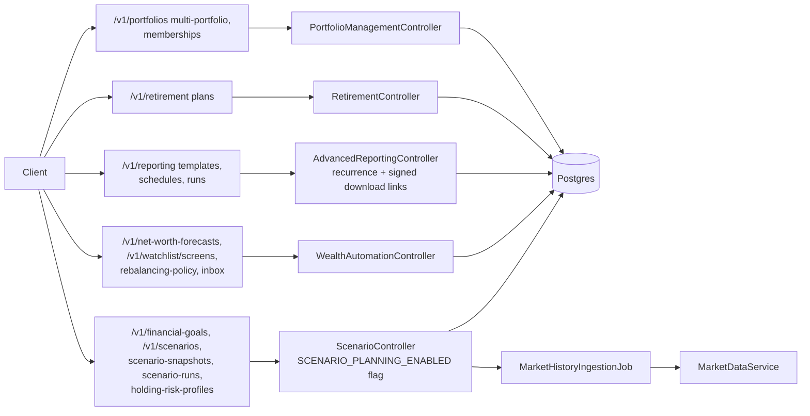

## Brokers (IBKR) and banking (Plaid)

Controllers: `Broker/BrokerController.swift`, `Banking/BankController.swift`, `Banking/PlaidWebhookController.swift`.

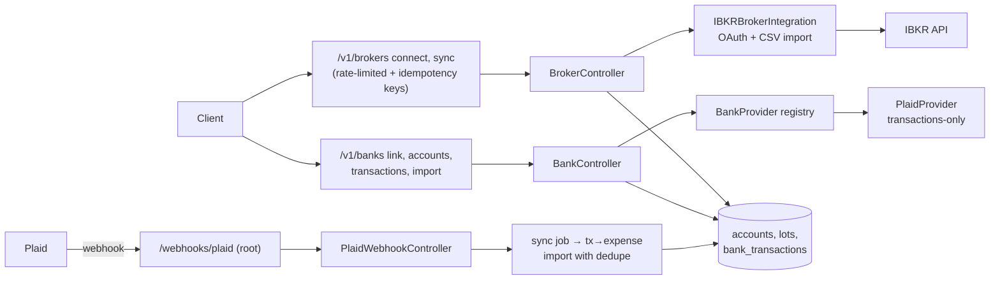

## Crypto

Controller: `Crypto/CryptoController.swift`.

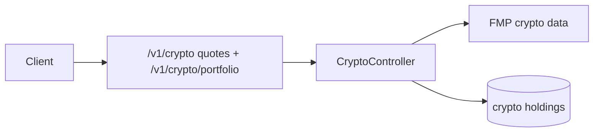

## Macro / inflation

Controller: `Macro/MacroController.swift` (Nowflation-parity pipeline).

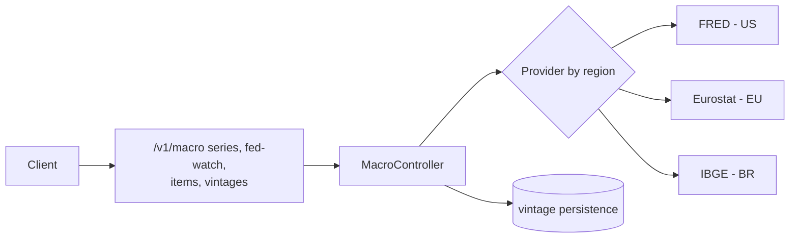

## Insights (Hermes sentiment)

Controller: `Insights/InsightsController.swift`; ticker sentiment computed on the Hermes VPS and fetched over Tailscale.

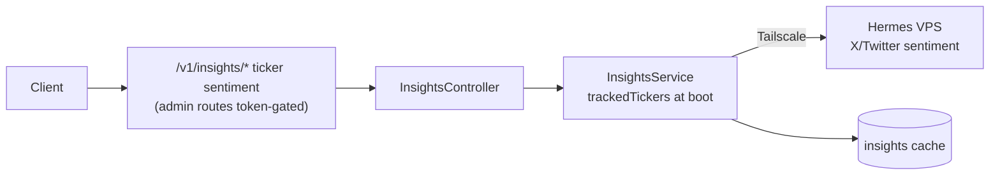

## News and earnings

Controllers: `News/NewsController.swift`, `Earnings/EarningsController.swift`.

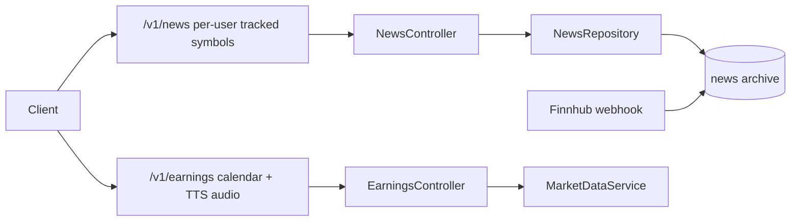

## Expenses, budget, receipts and financing

Controllers: `Expenses/ExpensesController.swift`, `Budget/BudgetController.swift`, `Receipts/ReceiptsController.swift`, `Financing/FinancingController.swift`.

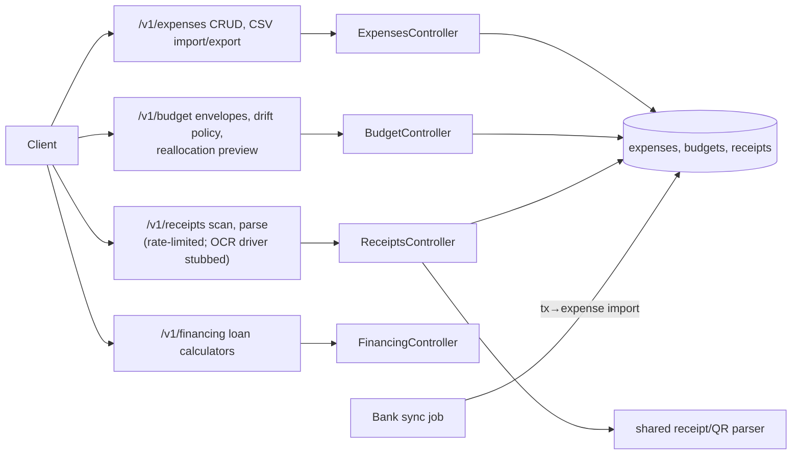

## Reports and data export

Controllers: `Reports/ReportsController.swift`, `Export/DataExportController.swift`, `Export/ExportFileController.swift`, `Sharing/SharingController.swift`.

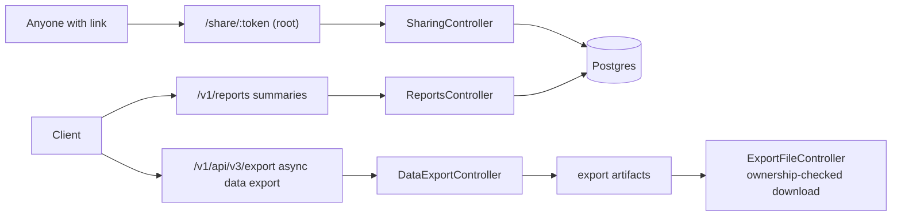

## AI assistant and MCP

Controllers: `AI/AIChatController.swift`, `AI/AIAssistantController.swift` (+ `AIAssistantStreamController.swift` SSE), `AI/AIInsightsController.swift`; tool registry `AI/AIChatToolRegistry.swift`. The MCP server itself lives in the separate `norviq-mcp` repo and calls back with scoped PATs.

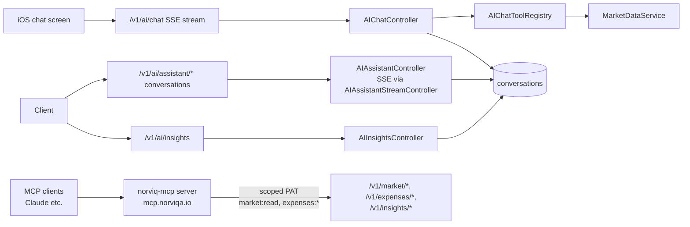

## Users, notifications, activities, badges, feedback

Controllers: `Users/UserProfileController.swift`, `Notifications/PushNotificationsController.swift`, `Activity/UserActivityController.swift`, `Badges/BadgeController.swift`, `Feedback/FeedbackController.swift`, `Assets/AssetsController.swift`, `Tax/TaxController.swift`, `Dashboard/DashboardController.swift`, `Goals/GoalsController.swift`, `Statistics/StatisticsController.swift`.

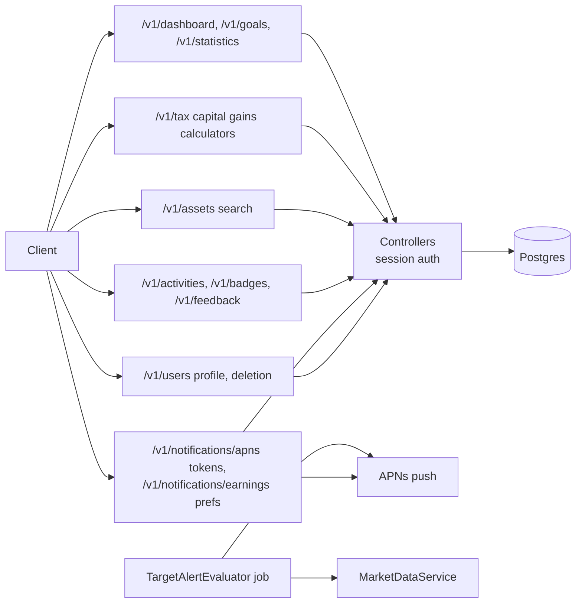

## Ops endpoints

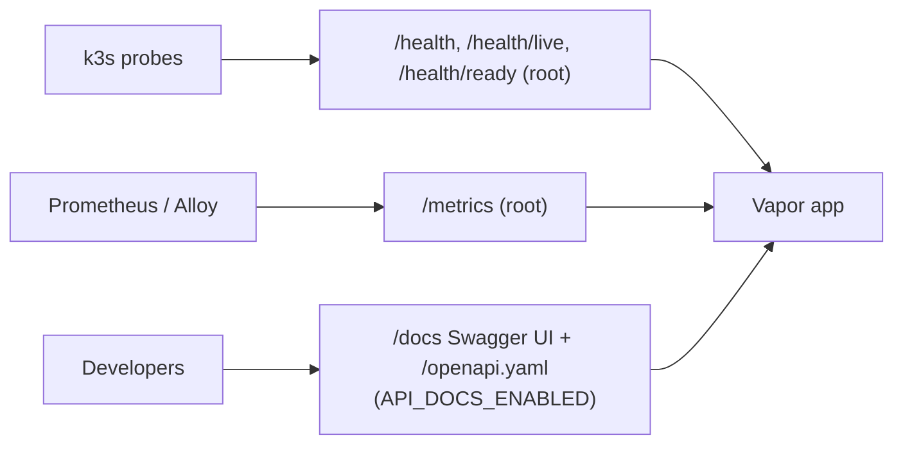
